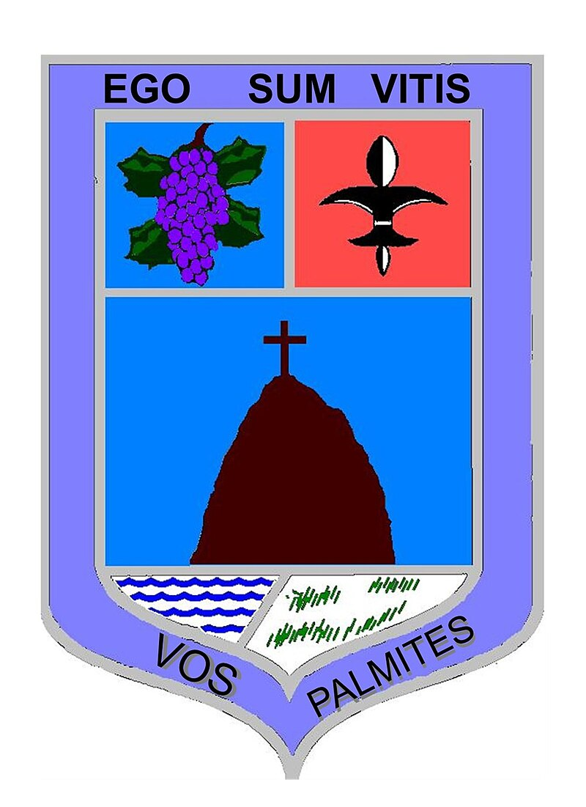

# web
</Html>
<html lang="es">
<head>
    <meta charset="UTF-8">
    <meta name="viewport" content="width=device-width, initial-scale=1.0">
    <title>Inicio: Ojocaliente</title>
    
</head>

<body>
    

        <nav>
            <ul class="nav">
                <li><a href="indexinicio.html">Inicio</a></li>
                <li><a href="#">Páginas</a>
                    <ul>
                        <li><a href="index_pobladores.html">Primeros pobladores</a></li>
                        <li><a href="index_inicios.html">Época prehispánica</a></li>
                        <li><a href="index_comunidad.html">Comunidades</a></li>
                        <li><a href="index_mitos.html">Mitos y leyendas</a></li>
                        <li><a href="index_lugares.html">Lugares turísticos</a></li>
                    </ul>
                </li>
                <li><a href="index_equipo.html">Equipo</a></li>
            </ul>
        </nav>
    

    <h1>Ojocaliente, Zacatecas, México</h1>

    <table>
        <tr>
            <td>
                
Ojocaliente, es un municipio del estado de Zacatecas, se encuentra en la región centro del estado de Zacatecas o de los valles del estado. 
                Colinda al norte con los municipios de Guadalupe, Trancoso y General Pánfilo Natera; al sur con Cuauhtémoc y Luis Moya; al poniente con 
                Genaro Codina y oriente con Noria de Ángeles y Villa González Ortega.

            </td>
            <td>
                
            </td>
        </tr>
    </table>

    
Ojocaliente es hogar de aproximadamente 40,000 personas, de las cuales el 20% reside en comunidades cercanas y no tan cercanas. 
    Es un municipio con amplias y variadas tradiciones y costumbres, como por ejemplo:

    
    <ul>
        <li>Feria regional de la Tuna y la Uva</li>
        <li>Danza de los Matlachines</li>
        <li>Día de la Santa Cruz</li>
        <li>Corridas de toros</li>
        <li>Birria de borrego</li>
    </ul>

    
Ojocaliente cuenta con la distinción de ciudad histórica obtenida el 25 de julio de 2003 por parte de la sexagésima legislatura del poder legislativo de Zacatecas.

    

        <iframe width="840" height="472" src="https://www.youtube.com/embed/OqB4CyA_PfU?si=1umaaZrLKnL3J8jP" title="YouTube video player" frameborder="0" allow="accelerometer; autoplay; clipboard-write; encrypted-media; gyroscope; picture-in-picture; web-share" referrerpolicy="strict-origin-when-cross-origin" allowfullscreen></iframe>
    

</body>
</html>

